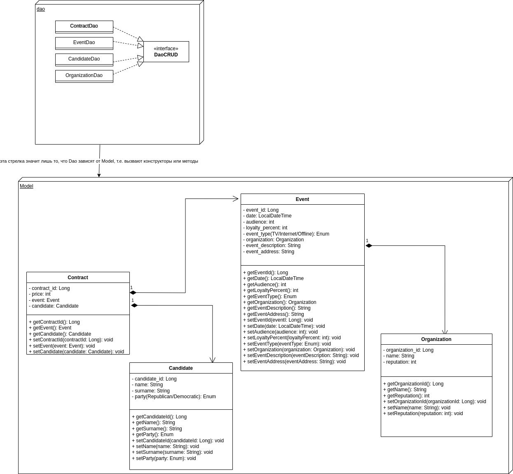

# Описание курса

## Содержание

[Инструкция](#Инструкция)

1. [Clean code and Java](#Clean-code-and-Java]):
    * [Задание 1](#Задание-1)
    * [Задание 2](#Задание-2)
    * [Задание 3](#Задание-3)
    * [Задание 4](#Задание-4)
    * [Задание 5](#Задание-5)
2. [SQL](#SQL):
    * [Задание 6](#задание-6)
    * [Задание 7](#задание-7)
3. [UML](#UML):
    * [Задание 8](#задание-8)
    * [Задание 0](#задание-9)
4. [Spring](#Spring):
    * [Задание 10](#задание-10)
    * [Задание 11](#задание-11)
    * [Задание 12](#задание-12)
    * [Задание 13](#задание-13)
    * [Задание 14](#задание-14)
    * [Задание 15](#задание-15)

## Инструкция.

**Человек напишет какой-то код, постарайтесь обратить внимание на моменты, которые сделаны не оптимально,
например, человек считает кол-во элементов в коллекции с помощью цикла, а мог бы вызвать метод объекта, вместо
лямбда-функции, пишет то же самое но длиннее, не использует Stream Api, где это возможно,предложите более
лучшую структуру данных в конкретной ситуации, даже если придется поменять реализацию в нескольких местах, если вы
знаете какой-то не сильно сложный в понимании алгоритм, который облечит чтение кода и ,возможно, оптимизирует его,
предложите человеку поискать, что это за алгоритм и какой кусок кода следует заменить. Следите за тем чтобы всё
соответствовало этому
документу [Конвенции](https://www.oracle.com/java/technologies/javase/codeconventions-namingconventions.html). Для
тестов нет определенных
соглашений, но лучше использовать следующую схему для нейминга "Класс теста называем в соответствии с именем класса
только добавляем Test в конце, методы следующим образом
ЧтоМетодДелает_whenСозданыОпределнныеУсловия_ThenShouldBeОжидаемыйРезультат". Человек может принимать
непривычные решения относительно реализации в коде, использовать например статические методы, где они не нужны,
внутренние классы, неграмотно пользоавться полями или примитивами, в таком случае либо объясните почему так не делают,
либо дайте ссылку для ознакомления(видео, статья, форум), либо напишите, что нужно изучить, чтобы разобраться. Если
видите, что есть хорошая возможность продемонстрировать работу какого-либо паттерна предложите его реализовать, но
дейлайте так, только в том случае, когда решение напрашивается само собой. Самое важное вы не пишите код за человека, не
додумываете решения пока человек не предоставит своё решение, оснавная суть, чтобы он мог гуглить и делал это на
английском, вы должны дать понимание о чем гуглить, исправлять неправильно интерптированную информацию.**

# Clean Code and Java

## Задание 1

Напишите консольное приложение, которое по тексту, введенному пользователем, будет искать слово, которое ввел
пользователь, в случае успеха надо вывести YES, в остальных случаях выведите NO.

С решением могут помочь следующие инструменты:

* StreamAPI
* Lambda-function
* Map
* ArrayList
* Class

## Задание 2

В дополнение к предыдущему заданию добавьте следующую логику, если слово существует, выведите YES, а так же для каждого
слова входящего в текст замените его на слово resolved и выведите этот текст. Протестируйте приложение с помощью JUnit.

С решением могут помочь следующие инструменты:

* Maven
* JUnit

### Примечание

Здесь предполагается использование StreamAPI, не говорите человеку, как он в идеале должен это сделать, возможно, кто-то
захочет сделать с использованием Stack, Array, ArrayList, когда он сделает скажите, что это неэффективно, так человек
проведет исследовательскую работу и будет лучше понимать, как пользоваться структурами и как они работают. Также после
написания попросите человека выделить реализацию в отдельный класс, если приложение написано в функции main.Если текст
или слово null выведите сообщение об этом.

## Задние 3

Метеорологическое агентство изучает глобальные процессы изменения погоды, для фиксации данных им нужно указать дату в
развернутом виде. Они хотят вбить дату в формате

```
07/14/2015
```

А на выходе получить следующую таблицу:

```
+------------+-------------+------------+------------------------------+
│ 14.07.2015 │   Tuesday   │    July    │    Tuesday, July 14, 2015    │ 
+------------+-------------+------------+------------------------------+
```

С решением могут помочь следующие инструменты:

* TimeAPI(форматирование, создание объекта)
* Calendar

### Примечание

Первый вариант:

```java
Date date=new SimpleDateFormat("MM/dd/yyyy").parse("07/14/2015");
        Calendar cal=Calendar.getInstance();
        cal.setTime(date);
        System.out.println((cal.getDisplayName(Calendar.MONTH,Calendar.LONG_FORMAT,Locale.CANADA)));
```

Второй вариант

```java
LocalDate date=LocalDate.parse("07/14/2015",DateTimeFormatter.ofPattern("MM/dd/yyyy"));
        System.out.println(date.format(DateTimeFormatter.ofLocalizedDate(FormatStyle.FULL).withLocale(Locale.CANADA)));
```

Можно создать класс/абстрактный класс/интерфейс View и там определить методы, где будем возвращать дату в определенном
виде, а саму таблицу будем
создавать уже в наследниках

## Задание 4

Боб работает на фабрике по производству опасных химикатов, по внутренним каналам организации распространился слух,
что формулы этих химикатов попали не в те руки, Боб хочет предотвратить возможную угрозу, для этого у него есть Алиса,
которая работает в ФБР, но данные нужно передать в зашифрованном виде, чтобы преступники не поняли, что их раскрыли.
Каждый день ФБР присылает секретную фразу, где английские буквы представляют собой символы, сегодня это фраза  
"The quick brown fox jumps over the lazy dog - TZ{9R71@&?=NYQ=4$R5XE=%{?TZ{/#F+A=!" зашифруйте фразу, котрую введет Боб
в консоль и протестируйте работу приложения.

С решением могут помочь следующие инструменты:

* List, ArrayList
* Map
* Классы с полями
* Override стандартных методов Object
* Interface

### Примечание

Тут не указано шифрование для пробелов, цифр и символов, человек должен подумать об этом и спросить у вас,
если он этого не сделал, то для начала предложите ему подумать все ли случаи он учел(в том числе, что проихойдет, если
предать пустую строку, null), если человек не догадывается, то
спросите, а все ли символы мы закодировали, подскажите, что могут быть и такие случаи, для этого предложите следующий
способ:  
Для каждого символа используйте следующий формат  "!"3{1, 7, 9}, где "!" - символ который не зашифровали, 3-сколько раз
он встречается в тексте, а в фигурных скобках позиции, где он встречается, порядок не имеет значения, можно реализовть
как отдельный класс с переопределением метода toString, а можно List<ArrayList>, можно Map, в выходном шифре
все кроме букв пропускатеся. Пример:

```
Console:
 Hello World! My name is Bob
 " "5{5, 12, 15, 20, 23}
 "!"1{11}
 Z{//=N=?/A5+Y#5{7E&=&
``` 

{ A-#,
B-&,
C-1,
D-A,
E-{,
F-Q,
G-!,
H-Z,
I-7,
J-$,
K-@,
L-/,
M-5,
N-Y,
O-=,
P-X,
Q-9,
R-?,
S-E,
T-T,
U-R,
V-%,
W-N,
X-4,
Y-+,
Z-F }.  
Так как шифровать можно не только текст, но и видео, аудио, то лучше всего сделать интерфейс с каим-то методом,
имплементировать его в конкретной реализации для текста. Так же хорошей подготовкой к дальнейшим заданием будет
реализация прокси класса, где мы заведем поле имеющее тип интерфейса, а в конструкторе будем присваивать имплементацию
интерфейса, это позволит не зависеть от конкретной реализации, а также будет хорошей отсылкой на Dependency Injection в
Spring.

## Задание 5

В сборную России по футболу ищут нового перспективного нападающего, ставку делают на скорость игрока, но это не
единственный фактор, также значительную роль играют процент голов игрока из зоны штрафной и престижность клуба, в
котором он находится. Побеждает футболист с наибольшим количеством очков, они рассчитываются по следующей формуле

```
12000 - время бега в миллисекундах + 10*(процент голов) + 2*(престижность клуба) 
```

Составьте таблицу с игроками и запишите её в выходной файл ( results.txt - его можно создать кодом на java ).
Пртестируйте работу.  
[Данные игроков](./footbalers.txt)

С решением могут помочь следующие инструменты:

* Three-Tier Architecture
* File procession
* TimeAPI
* Mockito

### Примечание

Здесь хорошо проследите за тем, чтобы была соблюдена трехслойная архитектура, должен быть отдельно пэкедж с файлами для
получения данных dao/data/repository, также можно сделать отдельный класс Footballer, он скорее должен находится в
пэкедже model, выисление данных и сортировка футболистов по местам это основная бизнес-логика программы, поэтому такой
класс должен расоплагаться в пэкедже service, здесь в качестве поля скорее всего нужно будет использовать класс из
repository, парсинг данных нужно проводить в классе из repository, так как service должен получать сразу данные, которые
ему нужны, а не выделять их из кучи ненужного. Обработка файлов должна производится с использованием StreamAPI,
Lambda-функций и цепочек методов, также в dao можно сделать интерфейс с методом getParameters(), допустим, если вы
рассматриваете футболистов на другие позиции, то вас могут интересовать другие параметры, а в сервисе можно использовать
тот же метод.

# SQL

## Задание 6

Вам дали задание разработать приложение для сети спортивных залов, в этом задании вам предстоит реализовать первую
часть,
во-первых разберитесь с тем как подключить базу данных, попробуйте для начала что-то сделать из консоли или
desktop-приложения, после этого определите, кто будет фигурировать в базе данных, т.е. о чем и о ком вы
хотите хранить информацию, а главное какую, после того как вы это поняли согласуйте эти сущности с ментором и добавьте
или уберите что-либо, на основании этого сделайте модели в Java-приложении, которые олицетворяли бы эти сущности,
добвьте возможность написания запросов к таблице прямо из приложения, а также скрипты для создания таблиц. Протестируйте
работу.

С решением могут помочь следующие инструменты:

* PostgreSQL
* Java JDBC
* SQL statements

### Примечание

Здесь не нужно конструировать сложную систему, смысл в том, чтобы сделать приложение по своей структуре напоминающее
Spring-вое приложение, где человек научиться напрямую работать с БД и писать запросы на SQL, а не с помощью ORM.
Это задание нацелено на то, чтобы написать в некотором роде, что делает hibernate. Выделите пэкедж с моделями, где будут
лежать классы соответствующие таблицам в вашей БД, а также сделайте пэкедж dao,
где вы будете осуществлять действия с таблицами, сохранение, удаление, чтение, изменение, Update можно добавить
частично, например, у тренера нужно изменить зал в котором он работает. Класс для получения connection лучше
унаследовать от AutoClosable и использовать try with resources(посмотрит реализацию javax.sql.DataSource и сделайте
свой, можно добавить, в котором вы будете загружать application.properties данные для подключения к БД и сделать один
метод для получения connection, без параметров). За основу можно взять следующие таблицы

```
Gym с полями id, working_hours, address
coach с полями id, gym_id, description_of_training, name, surname, age, work_experience, price
client с полями id, coach_id, name, surname, age
```

в этом заднии мы не используем ничего из Spring только внутренние инструменты Java JDBC, скрипты создания таблиц, данные
для подключения к БД, а также вспомогательные файлы вынесите в пэкедж resources.

## Задание 7

Реализуйте 2-ю часть вашего приложения, сделайте оставшиеся два слоя приложения service и controller.Сеть хочет
выглядеть элитной в глазах клиентов, для этого они решили вознаградить тренеров за их труд, размер премии вычисляется в
зависимости от количества тренировок в день, которые проводит тренер, клуб, вбив количество тренировок, хочет получить
список всех тренеров, которые имеют большее число клиентов по сравнению с вбитой цифрой. Вдобавок наша сеть хочет
улучшить сервис для этого она планирует вовремя оповещать всех клиентов тренера об изменении цен, о переносе тренировок
и т.д., выведите всех клиентов тренера по его имени и фамилии.

С решением могут помочь следующие инструменты:

* Aggregation function
* Filtering and sequence of result in sql

### Примечание

Для первого задания реализация в dao слое в классе CoachDao:

```roomsql
SELECT *
FROM coach
 LEFT JOIN client
  ON coach.id = client.coach_id
GROUP BY coach.id
HAVING COUNT(*) > ?
```

Для второго задания в dao слое в классе ClientDao:

```roomsql
SELECT *
FROM client
WHERE coach.id = ?    
```

В дополнение можно попросить написать, ну или рассказать каков был бы запрос, если для каждого зала нужно вывести
список тренеров с их ежедневным доходом и отсортировать от большего к меньшему, тут надо учитывать, что вам нужно
считать доход либо в запросе, либо в сервисе, но лучше в сервисе, тогда вам придется из запроса взять кол-во клиентов, а
такой результат уже не смапится на вашу модель тренера.

# UML

## Задание 8

Владелец крупной нефтяной компании хочет принять участие в выборах на пост президента США, как политик он пока не
состоялся, но у него есть четкий план как это сделать, ему нужно веб-приложение, где он смог бы планировать мероприятия,
в которых он должен принять участие, расходы на такие мероприятия, количество голосов, которые он хочет привлечь и
знать площадки, на которых эти мероприятия проводятся. Вам нужно разработать архитектуру такого приложения и нарисовать
UML
диаграмму для классов.

С решением могут помочь следующие инструменты:

* UML
* Class Diagram
* Three-Tier Architecture

### Примечание

Архитектура трехслойная как было до этого.
Нужно сделать только диаграмму для моделей, слой dao можно не трогать


## Задание 9

На основе вашей диаграммы реализуйте классы на Java.

## Примечание

Здесь нужно просто написать все классы пэкеджа model.

# Spring

## Задание 10

Реализуйте слой обработки данных dao с помощью инструментов Spring, добавив CRUD операции для каждой модели, а так же
протестируйте его.

С решением могут помочь следующие инструменты:

* JdbcTemplate
* Bean
* Annotation for data layer Spring
* H2 database(для тестов)
* Tomcat(Не нужен для тестирования, нужен для запуска приложения)
* Mapper

### Примечание

Mapper нужен для того, чтобы мапить результат операции базы данных на реальный объект Java.  
Проследите, что человек создал отдельный класс для конфигурации, где у него есть метод getDataSource(), который
возвращает DataSource, этот метод должен быть помечен ``@Bean``, чтобы в dao пэкедже мы могли сделать ``@Autowired`` и
использовать совместно с JdbcTemplate, так же покажите, что теперь можно не загружать Properties как мы делали в задании
с sql, теперь можно просто использовать ``@PropertySource + @Value``, также должны быть аннотации
``@Configuration+@ComponentScan``, они нужны для того чтобы приложение загрузило наши бины в свой контекст, мы можем
поместить эти аннотации вместе с классом для конфига и делать ``ComponentScan("com.resolved.dao")``, что было бы
логично, но можно и создать класс Main, разместить его в родительской для папок dao, config, model и делать scan оттуда,
так, например, делает SpringBoot. В пэкедже dao классы соответствуют моделям, эти классы должны быть помечены аннотацией
``@Repository``, чтобы соответствовать логике архитектуры приложения и чтобы эти объекты в дальнейшем использовать в
слое бизнес-логики service, сами классы должны имплементировать методы интерфейса DaoCRUD(или DaoCommon, или Dao),
параметризация нужна для облегчения работы, так как имеем общий подход к разным классам

```java
public interface DaoCRUD<T> {
    T save(T t) throws SQLException;//запись пришла без id, вернули вместе с id

    T findById(T t) throws SQLException;
    //Создали объект, в котором указали только id, вернули объект со всеми полями

    List<T> findAll() throws SQLException;//вернули все записи

    void update(T t);//передали id и измененные поля, обработали запрос

    void delete(T t);//передали id (остальные поля пустые) и удалили
}
```

## Задание 11

Реализуйте второй слой вашего приложения и протестируйте его.

С решением могут помочь следующие инструменты:

* Annotation for service layer Spring
* ModelMapper

### Примечание

Реализация должна быть в пэкедже service, к тому же в пэкедже configuration можно добавить конфиг для service, в котором
мы будем делать scan на пэкедж service, а также создавать ``@Bean`` ModelMapper, потому что, например, модель данных
используемая в service и в dao может отличаться, например вы хотите использовать какой-то объект в service, но уже в dao
вам надо разложить его полностью по полям, или, например, вы хотите конвертировать несколько полей, допустим вы храните
свой счет в рублях, но в сервисе хотите иметь структуру, которая хранит баланс в пяти валютах. В данном примере вы могли
хранить дату в американском стиле, а показывать в европейском, хранить стоимость в долларах, а показывать в другой
валюте, при выводе контракта не показывать всю информацию о событии, а только сообщать его номер, дату, место и цену,
это не значит, что так нужно делать, просто человеку нужно знать, что такой инструмент есть, в приложении можно сделать
маппинг хоть 1 к 1. К тому же надо сделать интерфейс service, он скорее всего будет повторять методы dao, он также
должен принимать параметр, только в слое service вы указываете модель с приставкой DTO, т.к. именно этот тип мы
возвращаем контроллерам. Все сервисы кроме интерфейса должны быть помечены ``@Service``. В тестах используйте моки для
слоя данных, т.е. классы с припиской Dao, к тому же должны быть тесты, которые проверяют выброс exception(соответствие
класса и соответствие сообщения), когда записи не существует или ошибка при маппинге, последнюю получится воссоздать с
помощью моков.

```bash
├── config
│   ├── DaoConfig.java
│   └── ServiceConfig.java
├── model
│   ├── Event.java
│   ├── Organization.java
│   ├── Candidate.java
│   └── Contract.java
├── dao
│   ├── DaoCRUD.java
│   ├── EventDao.java
│   ├── OrganizationDao.java
│   ├── CandidateDao.java
│   └── ContractDao.java
└── service
│   ├── dto
│       ├── EventDTO.java
│       ├── OrganizationDTO.java
│       ├── CandidateDTO.java
│       └── ContractDTO.java
│   ├── ServiceCommon.java
│   ├── EventService.java
│   ├── OrganizationService.java
│   ├── CandidateService.java
│   └── ContractService.java
```

## Задание 12

Добавьте логирование с помощью slf4j в своё приложение(логи сохраняйте в файл), а также реализуйте свои собственные
исключения в случаях, когда вам вернулся пустой результат при поиске или произошла ошибка маппинга, эти ошибки
могут встречаться уже при работе с Hibernate на более раннем этапе, также могут быть ошибки, когда вы пытаетесь
сохранить идентичную запись той, которую вы только что добавили, или удалить запись повторно, некоторые из них вы хотите
обработать особенным образом и внести коррективы в сообщение об ошибке, а для некоторых это не нужно.

С решением могут помочь следующие инструменты:

* logback
* slf4j
* Custom exceptions

### Примечание

Нужно добавить сообщения с уровнем debug перед тем как вы вызываете какой-то метод и после того, как он вернул что-то,
а также логировать ошибку в блоке catch, сделайте try catch на ошибку маппинга в слое service и на пустой результат в
слое dao, сами кастомные классы исключений должны располагаться в отдельном пэкедже exception.

## Задание 13

Создайте последний слой-контроллеры для вашего интерфейса, используя встроенный в Spring инструмент для работы с
Servlet, реализуйте web-интерфейс с использованием html и Thymeleaf

С решением могут помочь следующие инструменты:

* SpringMVC
* Configuration for Web app on Spring
* HTML
* Thymeleaf

### Примечание

Для конфигурации сервлета достаточно наследоваться от ``AbstractAnnotationConfigDispatcherServletInitializer`` с
переопределением методов.  
Для конфигурации контроллеров достаточно наследоваться от ``WebMvcConfigurer`` и использовать
аннотацию ``@EnableWebMvc`` с переопределением методов.  
Нужно использовать TemplateResolver с указанием того, где лежат ваши view, по умолчанию ``webapp/WEB-INF/views/``  
Html реализуйте по своему усмотрению, но постарайтесь использовать кнопки, выпадающие списки, ссылки на
методы, т.е. вы нашли event по id, добавьте ссылку на organization с использованием поиска по id уже в модели
Organization, добавьте кнопку удалить, которое бы удаляло событие.

```bash
├── config
│   ├── DaoConfig.java
│   ├── ServiceConfig.java
│   ├── ControllerConfig.java
│   └── ServletConfig.java
├── model
│   ├── Event.java
│   ├── Organization.java
│   ├── Candidate.java
│   └── Contract.java
├── dao
│   ├── DaoCRUD.java
│   ├── EventDao.java
│   ├── OrganizationDao.java
│   ├── CandidateDao.java
│   └── ContractDao.java
├── service
│   ├── dto
│       ├── EventDTO.java
│       ├── OrganizationDTO.java
│       ├── CandidateDTO.java
│       └── ContractDTO.java
│   ├── ServiceCommon.java
│   ├── EventService.java
│   ├── OrganizationService.java
│   ├── CandidateService.java
│   └── ContractService.java
├── controller
│   ├── EventController.java
│   ├── OrganizationController.java
│   ├── CandidateController.java
│   └── ContractController.java
```

## Задание 14

Создайте домашнюю страницу приложения и страницу, где бы сообщали об ошибке.

С решением могут помочь следующие инструменты:

* Handling exception with Spring

### Примечание

Просто создайте еще два контроллера, для контроллера ошибок лучше
использовать ``@ControllerAdvice+@ExceptionHandler``. Или можно создать кастомный класс унаследовавшись
от ``AbstractHandlerExceptionResolver`` это позволит отлавливать ошибки глобально и иметь возможность гибкого управления
ответом, но код получается громоздким, а в качестве ответа используется устаревший тип ``ModelAndView``.

## Задание 15

Добавьте Jndi для использования вашей базы данных в приложении.

### Примечание

Если вы вдруг не знаете как этим пользоваться, то вам понадобится класс ``JndiDataSourceLookup`` и его
метод ``getDataSource(String dataSourceName)``, в app.properties вы допустим
указываете ``datasource=jdbc/postgresYourDBName``, чтобы это работало ознакомьтесь с
туториалом [JNDI](https://www.digitalocean.com/community/tutorials/tomcat-datasource-jndi-example-java), смысл в том,
что вы определяете параметры подключения на сервере (Tomcat в нашем случае), это удобно так как вам не нужно
пересобирать приложение по новой в случае, если вы хотите что-то изменить. 
